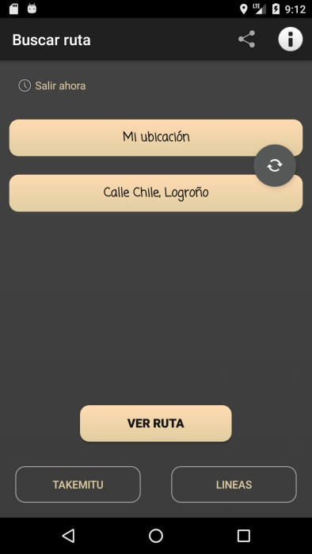
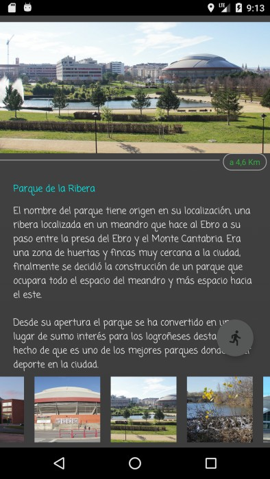
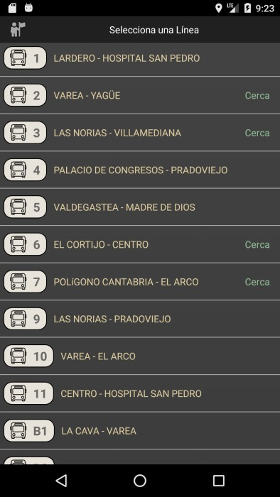
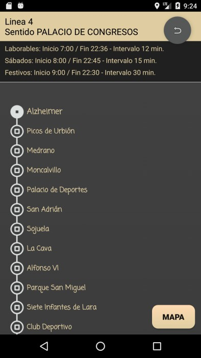
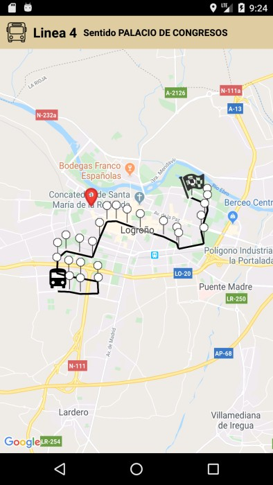
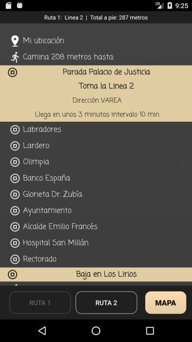
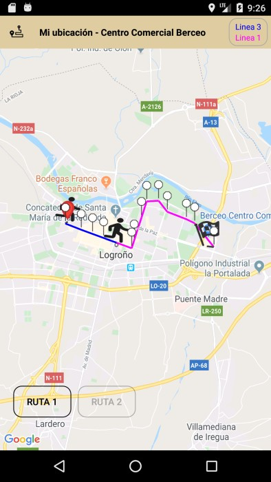
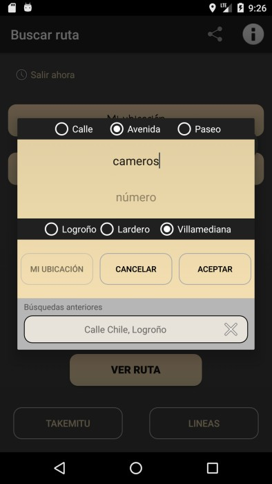
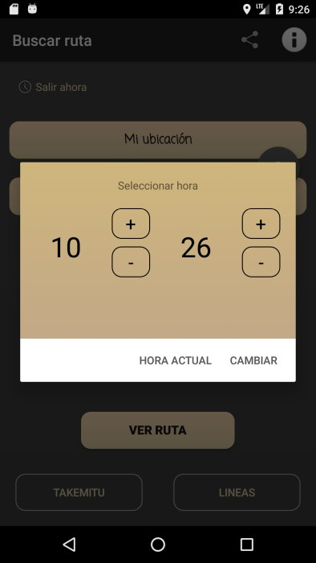

<h2>Descripción de Takemitu</h2>

Aplicación Android que muestra las rutas de autobuses en tiempo real, incluyendo geolocalización y seguimiento mediante Google Maps. Los datos se cargan desde una base de datos MySQL.

<h3>Tecnologías utilizadas</h3>

    Lenguaje: Java (Android)
    Frameworks y Librerías: Google Maps API, Retrofit, Volley
    Base de Datos: MySQL (phpMyAdmin)
    Backend: PHP (API REST)
    Geolocalización: Google Maps API, Location Services
    Consumo de datos: API REST con Volley
    Despliegue: Play Store

<h3>Principales funciones implementadas</h3>

✅ Mapa interactivo con Google Maps API para mostrar la ruta de cada autobús.

✅ Consulta de horarios y rutas con datos obtenidos de MySQL.

✅ Consumo de API REST mediante Volley para sincronización de datos.

✅ Geolocalización en tiempo real.

✅ Optimización de rendimiento para mejorar la carga y visualización de mapas.

<h3>Capturas de pantalla de la aplicación</h3>

<h3>Autoría</h3>

<b>Creado por: </b>Sergio Salgado

<b>Fecha: </b>Agosto de 2020

<h3>Notas</h3>

La aplicación está activa en la PlayStore.

[Visitar app en PlayStore](https://play.google.com/store/apps/details?id=com.saraodigital.takemitu)

